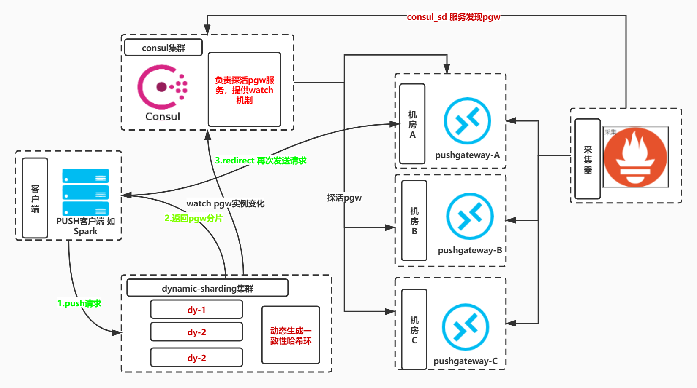
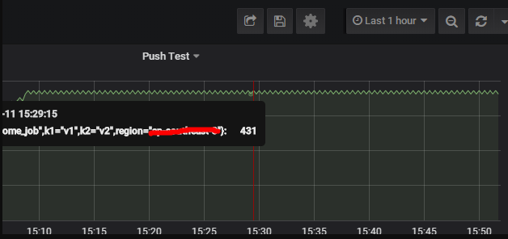
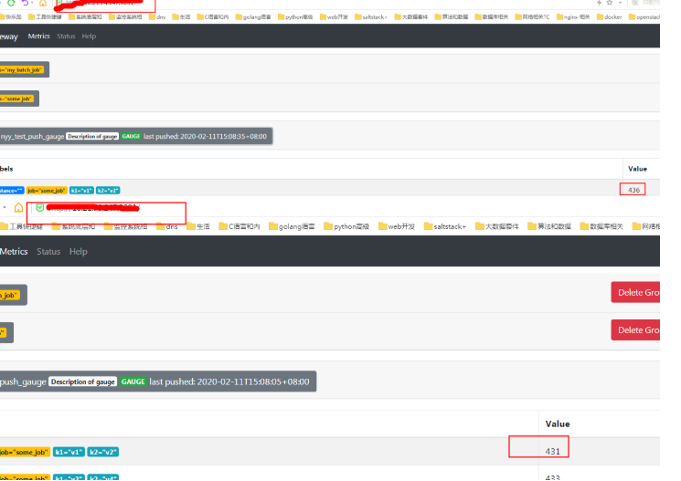

# k8s教程说明
- [k8s底层原理和源码讲解之精华篇](https://ke.qq.com/course/4093533)
- [k8s底层原理和源码讲解之进阶篇](https://ke.qq.com/course/4236389)

# prometheus全组件的教程
- [01_prometheus全组件配置使用、底层原理解析、高可用实战](https://ke.qq.com/course/3549215)
- [02_prometheus-thanos使用和源码解读](https://ke.qq.com/course/3883439)
- [03_kube-prometheus和prometheus-operator实战和原理介绍](https://ke.qq.com/course/3912017)
- [04_prometheus源码讲解和二次开发](https://ke.qq.com/course/4236995)

# go语言课程
- [golang基础课程](https://ke.qq.com/course/4334898)
- [golang运维平台实战，服务树,日志监控，任务执行，分布式探测](https://ke.qq.com/course/4334675)


# 关于白嫖和付费
- 白嫖当然没关系，我已经贡献了很多文章和开源项目，当然还有免费的视频
- 但是客观的讲，如果你能力超强是可以一直白嫖的，可以看源码。什么问题都可以解决
- 看似免费的资料很多，但大部分都是边角料，核心的东西不会免费，更不会有大神给你答疑
- thanos和kube-prometheus如果你对prometheus源码把控很好的话，再加上k8s知识的话就觉得不难了

# 架构图

# pgw是什么
[项目介绍](https://github.com/prometheus/pushgateway)

## pgw打点特点

- 没有使用grouping对应的接口uri为 
```
http://pushgateway_addr/metrics/job/<JOB_NAME>
```
- 使用grouping对应的接口uri为 
```
http://pushgateway_addr/metrics/job/<JOB_NAME>/<LABEL_NAME>/<LABEL_VALUE>
```
- put/post方法区别在于 put只替换metrics和job相同的 post替换label全部相同的
# pgw单点问题
## 如果简单把pgw挂在lb后面的问题
- lb后面rr轮询:如果不加控制的让push数据随机打到多个pushgateway实例上,prometheus无差别scrape会导致数据错乱,表现如下



- 根本原因是在t1时刻 指标的值为10 t2时刻 值为20
- t1时刻轮询打点到了pgw-a上 t2时刻打点到了pgw-b上
- 而promethues采集的时候两边全都采集导致本应该一直上升的值呈锯齿状
## 如果对uri做静态一致性哈希+prome静态配置pgw
- 假设有3个pgw,前面lb根据request_uri做一致性哈希
- promethues scrape时静态配置3个pgw实例
```
  - job_name: pushgateway
    honor_labels: true
    honor_timestamps: true
    scrape_interval: 5s
    scrape_timeout: 4s
    metrics_path: /metrics
    scheme: http
    static_configs:
    - targets:
      - pgw-a:9091
      - pgw-b:9091

```
- 结果是可以做到哈希分流,但无法解决某个pgw实例挂掉,哈希到这个实例上面的请求失败问题

## 解决方案是: 动态一致性哈希分流+consul service_check

- dynamic-sharding服务启动会根据配置文件注册pgw服务到consul中
- 由consul定时对pgw server做http check
- push请求会根据请求path做一致性哈希分离,eg:
```
# 仅job不同
- http://pushgateway_addr/metrics/job/job_a
- http://pushgateway_addr/metrics/job/job_b
- http://pushgateway_addr/metrics/job/job_c
# label不同
- http://pushgateway_addr/metrics/job/job_a/tag_a/value_a
- http://pushgateway_addr/metrics/job/job_a/tag_a/value_b
```
- 当多个pgw中实例oom或异常重启,consul check service会将bad实例标记为down
~~- dynamic-sharding轮询检查实例数量变化~~
- dynamic-sharding 会`Watch` pgw节点数量变化
- 重新生成哈希环,rehash将job分流
- 同时promethues使用consul服务发现的pgw实例列表,无需手动变更
- 采用redirect而不处理请求,简单高效
- dynamic-sharding本身无状态,可启动多个实例作为流量接入层和pgw server之间
- 扩容时同时也需要重启所有存量pgw服务
- 不足:没有解决promethues单点问题和分片问题
项目地址: [https://github.com/ning1875/dynamic-sharding](https://github.com/ning1875/dynamic-sharding)

## 使用指南
   
> 编译或下载
```shell script
# 编译build
$ git clone https://github.com/ning1875/dynamic-sharding.git
$ cd  dynamic-sharding && make 
# 下载 ：releases中直接下载tag包
# 如https://github.com/ning1875/dynamic-sharding/releases/download/v2.0/dynamic-sharding-2.0.linux-amd64.tar.gz
```

> 修改配置
```shell script
# 修改配置文件
# 补充dynamic-sharding.yml中的信息:
```

> 启动dynamic-sharding服务

```shell script
./dynamic-sharding --config.file=dynamic-sharding.yml
```
 
> 和promtheus集成 
> Add the following text to your promtheus.yaml's scrape_configs section
```yaml
scrape_configs:
  - job_name: pushgateway
    consul_sd_configs:
      - server: $cousul_api
        services:
          - pushgateway
    relabel_configs:
    - source_labels:  ["__meta_consul_dc"]
      target_label: "dc"

```
> 调用方调用 dynamic-sharding接口即可 eg: http://localhost:9292/

## 运维指南

### pgw节点故障 (无需关心) 
> eg: 启动了4个pgw实例,其中一个宕机了,则流量从4->3,以此类推


### pgw节点恢复 
> eg: 启动了4个pgw实例,其中一个宕机了,过一会儿恢复了,那么它会被consul unregister掉
> 避免出现和扩容一样的case: 再次rehash的job 会持续在原有pgw被prome scrap，而且value不会更新


### 扩容
> 修改yml配置文件将pgw servers 调整到扩容后的数量,重启服务dynamic-sharding 
> 注意 同时也要重启所有存量pgw服务,不然rehash的job 会持续在原有pgw被prome scrap，而且value不会更新


### 缩容

```shell script
# 方法一
## 调用cousul api  
curl -vvv --request PUT 'http://$cousul_api/v1/agent/service/deregister/$pgw_addr_$pgw_port'
eg: curl -vvv --request PUT 'http://localhost:8500/v1/agent/service/deregister/1.1.1.1_9091'

## 修改yml配置文件将pgw servers 调整到缩容后的数量，避免服务重启时再次注册缩容节点

# 方法二
## 停止缩容节点服务,consul会将服务踢出,然后再注销

```


### 使用python sdk时遇到的 urllib2.HTTPError: HTTP Error 307: Temporary Redirect 问题
#### 原因
- 查看代码得知python sdk在构造pgw实例时使用默认的handler方法，而其没有`follow_redirect`导致的

```python
def push_to_gateway(gateway, job, registry, grouping_key=None, timeout=30,handler=default_handler):
```

#### 解决方法

- 使用requests库自定义一个handler，初始化的时候指定

```python
def custom_handle(url, method, timeout, headers, data):
    def handle():
         h = {}
         for k, v in headers:
            h[k] = v
         if method == 'PUT':
            resp = requests.put(url, data=data, headers=h, timeout=timeout)
         elif method == 'POST':
            resp = requests.post(url, data=data, headers=h, timeout=timeout)
         elif method == 'DELETE':
            resp = requests.delete(url, data=data, headers=h, timeout=timeout)
         else:
            return
         if resp.status_code >= 400:
            raise IOError("error talking to pushgateway: {0} {1}".format(resp.status_code, resp.text))
    return handle
 
# push_to_gateway(push_addr, job='some_job', registry=r1, handler=custom_handle)
```


